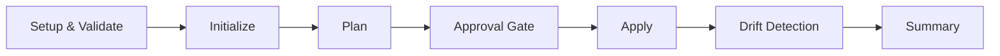

# Quick Start Guide - Complete Terraform Deployment

A quick reference for using `lothslair-workflow-actions` to build complete Terraform deployment workflows.

## TL;DR - Copy This Template

```yaml
name: Deploy Infrastructure

on:
  workflow_dispatch:
    inputs:
      environment:
        type: choice
        options: [dev, staging, prod]
        required: true

permissions:
  contents: read
  id-token: write
  issues: write

jobs:
  validate:
    runs-on: ubuntu-latest
    steps:
      - uses: actions/checkout@v4
      - uses: lothslair/lothslair-workflow-actions/setup@main
      - uses: lothslair/lothslair-workflow-actions/validate@main
        with:
          working_dir: 'terraform/'

  init:
    needs: validate
    runs-on: ubuntu-latest
    steps:
      - uses: actions/checkout@v4
      - uses: lothslair/lothslair-workflow-actions/setup@main
      - uses: lothslair/lothslair-workflow-actions/init@main
        with:
          backend_rg: ${{ secrets.BACKEND_RG }}
          backend_sa: ${{ secrets.BACKEND_SA }}
          backend_sa_container: tfstate
          backend_sa_key: ${{ inputs.environment }}.tfstate
          working_dir: terraform/

  plan:
    needs: init
    runs-on: ubuntu-latest
    outputs:
      exit_code: ${{ steps.plan.outputs.exitcode }}
    steps:
      - uses: actions/checkout@v4
      - uses: lothslair/lothslair-workflow-actions/setup@main
      - name: Plan
        id: plan
        uses: lothslair/lothslair-workflow-actions/plan@main
        with:
          environment: ${{ inputs.environment }}
          working_dir: terraform/
          params_dir: terraform/environments

  apply:
    needs: plan
    if: needs.plan.outputs.exit_code == 2
    environment: ${{ inputs.environment }}
    runs-on: ubuntu-latest
    steps:
      - uses: actions/checkout@v4
      - uses: lothslair/lothslair-workflow-actions/setup@main
      - uses: lothslair/lothslair-workflow-actions/download@main
        with:
          environment: ${{ inputs.environment }}
          working_dir: terraform/
      - uses: lothslair/lothslair-workflow-actions/apply@main
        with:
          environment: ${{ inputs.environment }}
          working_dir: terraform/
          plan_exit_code: ${{ needs.plan.outputs.exit_code }}
```

## 7-Stage Deployment Pattern



### Stage 1: Setup & Validate
**What it does**: Prepares Terraform environment and validates configuration

```yaml
setup-and-validate:
  steps:
    - uses: lothslair/lothslair-workflow-actions/setup@main
    - uses: lothslair/lothslair-workflow-actions/validate@main
      with:
        working_dir: 'terraform/'
    - uses: lothslair/lothslair-workflow-actions/format@main
      with:
        working_dir: 'terraform/'
        check_only: 'true'
```

**Why**: Catch errors early before touching infrastructure state

---

### Stage 2: Initialize
**What it does**: Sets up Terraform backend and locks state

```yaml
terraform-init:
  needs: setup-and-validate
  steps:
    - uses: lothslair/lothslair-workflow-actions/init@main
      with:
        backend_rg: ${{ secrets.BACKEND_RG }}
        backend_sa: ${{ secrets.BACKEND_SA }}
        backend_sa_container: ${{ secrets.BACKEND_CONTAINER }}
        backend_sa_key: ${{ inputs.environment }}.tfstate
        working_dir: terraform/
        github_token: ${{ secrets.GITHUB_TOKEN }}
```

**Required Secrets**:
- `BACKEND_RG` - Azure Resource Group containing storage
- `BACKEND_SA` - Azure Storage Account name
- `BACKEND_CONTAINER` - Container/blob name for state
- `GITHUB_TOKEN` - (or GITHUB_ACTIONS token)

---

### Stage 3: Plan
**What it does**: Generates execution plan showing what will change

```yaml
terraform-plan:
  needs: terraform-init
  outputs:
    exit_code: ${{ steps.plan.outputs.exitcode }}
  steps:
    - id: plan
      uses: lothslair/lothslair-workflow-actions/plan@main
      with:
        environment: ${{ inputs.environment }}
        working_dir: terraform/
        params_dir: terraform/environments
```

**Exit Codes**:
- `0` = No changes
- `2` = Changes detected
- `1` = Error occurred

---

### Stage 4: Approval Gate
**What it does**: Creates GitHub issue requiring human review for changes

```yaml
approval:
  needs: terraform-plan
  if: needs.terraform-plan.outputs.exit_code == 2
  steps:
    - uses: actions/github-script@v7
      with:
        script: |
          github.rest.issues.create({
            owner: context.repo.owner,
            repo: context.repo.repo,
            title: 'Approve: Terraform deploy to ${{ inputs.environment }}',
            body: 'Review the plan and approve by commenting /approve'
          })
```

**Why**: Prevents accidental changes to production infrastructure

---

### Stage 5: Apply
**What it does**: Applies the approved plan to infrastructure

```yaml
terraform-apply:
  needs: terraform-plan
  if: needs.terraform-plan.outputs.exit_code == 2
  environment: ${{ inputs.environment }}  # Requires environment protection rules
  steps:
    - uses: lothslair/lothslair-workflow-actions/download@main
      with:
        environment: ${{ inputs.environment }}
        working_dir: terraform/
    - uses: lothslair/lothslair-workflow-actions/apply@main
      with:
        environment: ${{ inputs.environment }}
        working_dir: terraform/
        plan_exit_code: ${{ needs.terraform-plan.outputs.exit_code }}
```

**Safety**: Uses downloaded plan (prevents plan-apply drift)

---

### Stage 6: Drift Detection
**What it does**: Verifies no manual infrastructure changes occurred

```yaml
drift-detection:
  needs: terraform-apply
  if: always()
  steps:
    - uses: lothslair/lothslair-workflow-actions/drift@main
      with:
        environment: ${{ inputs.environment }}
        working_dir: terraform/
        params_dir: terraform/environments
```

---

### Stage 7: Summary
**What it does**: Reports deployment status and results

```yaml
summary:
  runs-on: ubuntu-latest
  if: always()
  needs: [setup, init, plan, apply]
  steps:
    - run: |
        echo "| Stage | Status |" >> $GITHUB_STEP_SUMMARY
        echo "|-------|--------|" >> $GITHUB_STEP_SUMMARY
        echo "| Setup | ✅ |" >> $GITHUB_STEP_SUMMARY
        echo "| Init  | ✅ |" >> $GITHUB_STEP_SUMMARY
        echo "| Plan  | ✅ |" >> $GITHUB_STEP_SUMMARY
        echo "| Apply | ✅ |" >> $GITHUB_STEP_SUMMARY
```

---

## File Structure

Your repository should be organized like this:

```
.
├── .github/workflows/
│   ├── deploy.yml                          # Your workflow
│   └── terraform-complete-deployment.yml   # Template from lothslair-workflow-actions
├── terraform/
│   ├── main.tf
│   ├── variables.tf
│   ├── outputs.tf
│   └── environments/
│       ├── dev-variables.tfvars
│       ├── staging-variables.tfvars
│       └── prod-variables.tfvars
└── docs/
    └── (Optional) deployment documentation
```

---

## Common Patterns

### Pattern 1: Dev Auto-Deploy (No Approval)

```yaml
terraform-apply:
  if: |
    needs.terraform-plan.outputs.exit_code == 2 &&
    inputs.environment == 'dev'
  # Skips approval gate for dev
```

### Pattern 2: Prod Manual-Only

```yaml
terraform-apply:
  if: github.event_name == 'workflow_dispatch'  # Only manual trigger
  environment: prod  # Requires environment protection rules
```

### Pattern 3: Multi-Region

```yaml
strategy:
  matrix:
    region: [us-east, eu-west, ap-south]
with:
  working_dir: terraform/${{ matrix.region }}/
```

### Pattern 4: Plan Artifact Archive

```yaml
- uses: actions/upload-artifact@v3
  with:
    name: terraform-plan-${{ inputs.environment }}
    path: terraform/*.tfplan
    retention-days: 90
```

---

## Troubleshooting

### "Invalid environment name"
```yaml
# ❌ Invalid
environment: prod!

# ✅ Valid
environment: prod
```

### "Directory not found"
```yaml
# ❌ Wrong
working_dir: ./terraform

# ✅ Correct
working_dir: terraform/
```

### "Variable file not found"
```
Expected: terraform/environments/prod-variables.tfvars
Found: terraform/prod-ado-variables.tfvars

# ✅ Use: terraform/environments/prod-variables.tfvars
```

### "Plan file not found on apply"
```yaml
# Must download plan first
- uses: lothslair/lothslair-workflow-actions/download@main
  with:
    environment: ${{ inputs.environment }}
    working_dir: terraform/

- uses: lothslair/lothslair-workflow-actions/apply@main
  # Now plan file is available
```

### "Permission denied for state backend"
```
Error: Failed to authenticate with Azure Storage

Verify secrets exist:
✓ BACKEND_RG
✓ BACKEND_SA
✓ BACKEND_CONTAINER
✓ Azure authentication configured (OIDC or CLI)
```

---

## GitHub Annotations

Actions automatically report status using GitHub annotations:

```
::error::Critical failure - deployment blocked
::warning::Infrastructure changes require approval
::notice::✅ Stage completed successfully
```

These appear in:
- ✅ Workflow run summary
- ✅ GitHub Actions logs
- ✅ Pull request comments (if triggered from PR)

---

## Security Checklist

- [ ] Backend secrets configured (RG, SA, Container)
- [ ] Azure authentication configured (OIDC or CLI)
- [ ] Environment protection rules set for production
- [ ] No embedded credentials in workflows
- [ ] Git token only passed via environment variable
- [ ] Approval gate enabled for production
- [ ] Drift detection configured
- [ ] Plan artifacts archived for audit trail

---

## Complete Example

See [DEPLOYMENT_WORKFLOW_EXAMPLE.md](DEPLOYMENT_WORKFLOW_EXAMPLE.md) for:
- ✅ Full 7-stage workflow with all steps
- ✅ Error handling patterns
- ✅ Multi-environment deployment
- ✅ Drift detection
- ✅ External tool integration (Slack, PagerDuty, email)

See [terraform-complete-deployment.yml](.github/workflows/terraform-complete-deployment.yml) for:
- ✅ Ready-to-use workflow template
- ✅ All approval gating logic
- ✅ Drift detection
- ✅ Comprehensive summaries

---

## Next Steps

1. **Copy the workflow template** from `terraform-complete-deployment.yml`
2. **Configure secrets** in GitHub repository settings
3. **Organize Terraform files** in the expected structure
4. **Test on dev** environment first
5. **Set protection rules** for staging/prod environments
6. **Review deployment logs** and summaries

---

## More Information

- 📖 [Complete Workflow Guide](DEPLOYMENT_WORKFLOW_EXAMPLE.md)
- 📝 [Input Validation Guide](INPUT_VALIDATION.md)
- ⚠️ [Error Handling Guide](ERROR_HANDLING.md)
- 🔐 [Security Best Practices](../README.md#security--best-practices)
